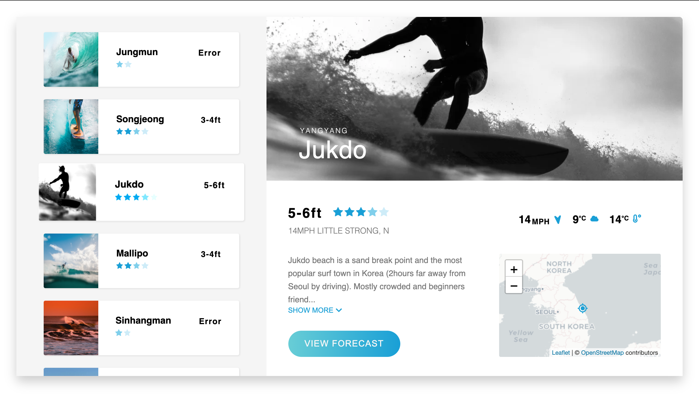

# About the page

**Surfing in Korea** is a web application which gives informations and forecast of popular surf spots in Korea.


Check surf forecasts and get info of popular surf spots in Korea on [live demo](https://surfinginkorea.netlify.app/)!

## Built with

- [HTML](https://html.com/), [Css](https://developer.mozilla.org/en-US/docs/Web/CSS), [JavaScript](https://www.javascript.com/)
- [React](https://reactjs.org/), [React Hooks](https://reactjs.org/docs/hooks-intro.html), [React Router](https://reactrouter.com/), [Styled Components](https://styled-components.com/)
- [React leaftlet](https://react-leaflet.js.org/), [Axios](https://github.com/axios/axios), [Moment.js](https://momentjs.com/)
- [React Icons](https://react-icons.github.io/react-icons/), [Dotenv](https://www.npmjs.com/package/dotenv), [Netlify](https://www.netlify.com/)
- [World weather online](https://www.worldweatheronline.com/)

## Website content

There are some people who wants to surf in Korea but don't have any information about the surf spots unless they have Korean surfer friends or can read Korean articles and it's a huge benefit having some info about the spot before jump into water.

For them, this application provides **weather**, **temperature**, **water temperature**, **wind direction**, **wind speed**, **swell height**, **swell direction**, **sunset**, **sunrise**, **tide**, **star rating**, every **3 hours** and upcoming **7 days** also **description** of spots.

## Getting started

### Clone project

```bash
git clone https://github.com/thinkJin6/SurfingInKorea.git
```

### Install npm dependencies

```bash
npm install
```

### Get API Key

#### from [worldweatheronline.com](https://www.worldweatheronline.com/developer/api/docs) and put the API key with [.env](https://www.npmjs.com/package/dotenv) file and Run the project

```bash
npm start
```

## Publishing the website

Surfing in Korea website is published automatically on the Netlify platform. Whenever changes are pushed to the main branch, the site is re-built and re-deployed, usually within about one minute.

## Contact

[thinkjin6@gmail.com](https://mail.google.com/mail/u/0/#inbox?compose=DmwnWrRpdLlVtFTbpNJTVjslHngsBTsKJxLhjmswTCKkndRpCGnBxLcsLlbWQjTtXPBWwnHqJcMg)

## License

[MIT](https://choosealicense.com/licenses/mit/)
